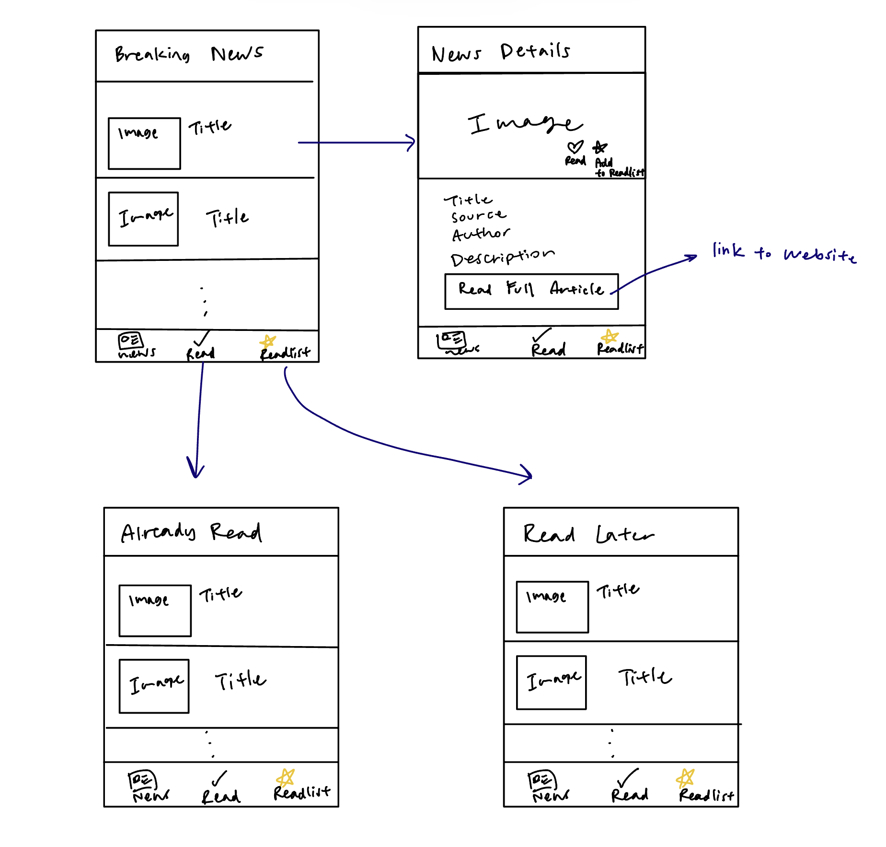

# Breaking News V1

## Table of Contents

1. [Overview](#Overview)
2. [Product Spec](#Product-Spec)
3. [Wireframes](#Wireframes)
4. [Schema](#Schema)

## Overview
Here's a walkthrough  of implemented features:

### Description

This app uses the [News API](https://newsapi.org/docs/get-started) to display breaking news headlines. The app allows users to save articles that have already been read and save articles to read later.

### App Evaluation

- **Category:** News
- **Mobile:** Mobile is ideal for real-time alerts, location-based news delivery, and quick browsing.
- **Story:** Keeps users informed with fast, relevant, and minimal-bias news. Combats news fatigue by filtering out low-impact headlines and clickbait.  
- **Market:** News readers, professionals, travelers, and anyone who wants to stay informed without scrolling endlessly. Could target younger users turned off by traditional media. 
- **Habit:** Users open the app multiple times daily or rely on push notifications for top stories. Customization and urgency drive repeated engagement. 
- **Scope:** V1 could launch with top curated stories. V2 adds filtering by categories. V3 adds location-based feeds and user-defined keywords.

## Product Spec

### 1. User Stories (Required and Optional)

**Required Must-have Stories**

* As a user, I want to see a list of the latest breaking news headlines as soon as I open the app.
* As a user, I want to read a description and have a link to the full article by tapping on a headline.
* As a user, I want to mark articles as "Read" or "Readlist"
* As a user, I want to see a list of my read articles.
* As a user, I want to see a list of my saved for later (readlist) articles.
* As a user, I want the app to load quickly and display content in a clean, minimal UI.

**Optional Nice-to-have Stories (Future Implementation)**

* As a user, I want to search for articles.
* As a user, I want to personalize my news feed based on selected interests or topics.
* As a user, I want to view local news based on my current location.
* As a user, I want to receive daily digests or summaries of top stories.
* As a user, I want to share articles easily via social media or messaging apps.
* As a user, I want to receive push notifications for major breaking news stories.

### 2. Screen Archetypes

Breaking News View
* As a user, I want to see a list of the latest top headlines as soon as I open the app.

News Details View
* As a user, I want to read a description and have a link to the full article by tapping on a headline.
* As a user, I want to mark articles as "read/favorites" or "saved for later."

Read View
* As a user, I want to see a list of my read articles.

Readlist View
* As a user, I want to see a list of my saved for later articles.

### 3. Navigation

**Tab Navigation** (Tab to Screen)

* News
* Read
* Readlist

**Flow Navigation** (Screen to Screen)

Breaking News View
* click on list item to navigate to News Details
* click on Read tab to navigate to Read View
* click on Readlist tab to navigate to Readlist View

News Details View
* click on News tab to navigate to Breaking News View
* click on Read tab to navigate to Read View
* click on Readlist tab to navigate to Readlist View
  
Read View
* click on list item to navigate to News Details
* click on News tab to navigate to Breaking News View
* click on Readlist tab to navigate to Readlist View

Readlist View
* click on list item to navigate to News Details
* click on News tab to navigate to Breaking News View
* click on Read tab to navigate to Read View

## Wireframes

### [BONUS] Digital Wireframes & Mockups

### [BONUS] Interactive Prototype

## Schema 

[This section will be completed in Unit 9]

### Models

[Add table of models]

### Networking

- News Views: `https://newsapi.org/v2/top-headlines?country=us&apiKey=[API_KEY]`
- Used News API to make request to the top headlines in the United States
